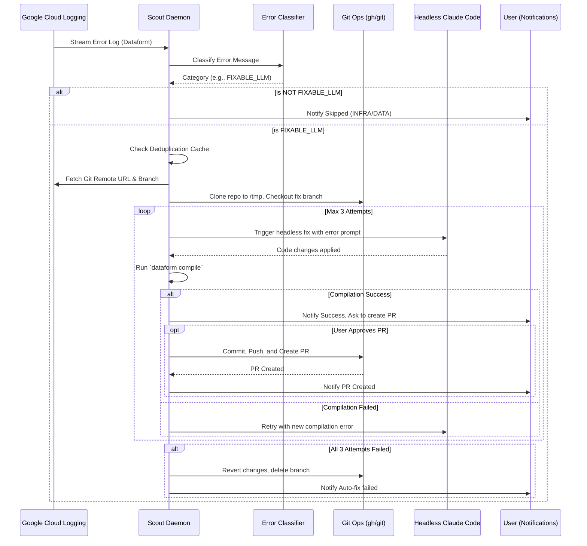

# Dataform Scout Specifications

## High-Level Overview
Dataform Scout is a Claude Code Marketplace plugin designed to automatically self-heal Google Cloud Dataform repositories. It operates as a background daemon that monitors GCP Dataform error logs using local `gcloud` credentials. When it detects a failing Dataform pipeline (e.g., a SQL compilation error), it identifies the repository and branch, clones it locally into a temporary workspace, and delegates the fix to a headless Claude Code agent.

The plugin aims to reduce developer toil by automatically addressing simple compilation and syntax errors (`FIXABLE_LLM`), while ignoring infrastructural or pure data issues (`INFRA`, `DATA`).

## Trigger Mechanism
The scout daemon is triggered **automatically** when a Claude Code session launches. It hooks into the `SessionStart` event of the Claude plugin framework.
- It requires a first-time configuration (`/dataform-scout:scout-configure`) to define the GCP scope (Project, Folder, or Organization) to monitor.
- Once configured, it runs `gcloud beta logging tail` to stream real-time logs matching Dataform repository errors.
- It also runs a 24-hour lookback upon startup to catch any recent errors that might have occurred while the daemon was offline.

## Configuration
Dataform Scout requires an initial configuration step before the daemon can start monitoring logs. 
This is achieved by running the interactive slash command:
`/dataform-scout:scout-configure`

This wizard writes the configuration to `~/.config/dataform-scout/config`.

### Current Configuration Items
Currently, the configuration primarily supports defining the **GCP Scope** used for the `gcloud` logging tail process. The `scope_type` and `scope_id` map directly to `gcloud` flags:
- `project` (adds `--project <id>`)
- `folder` (adds `--folder <id>`)
- `organization` (adds `--organization <id>`)

*Note: The scout daemon will default to the active `gcloud config get-value project` if no explicit config is found, though the UI will prompt the user to configure it on the first launch.*

### Manual Actions
The in-memory deduplication cache can be manually cleared by users without restarting the daemon. Executing the clear cache routine sends a `SIGUSR1` signal to the background daemon, immediately resetting its 5-minute rolling memory of skipped errors.

## Error Handling Workflow
When an error log is received from the real-time stream or the lookback, the daemon executes the following steps:

1. **Extraction & Classification**: Extracts the error message, target `.sqlx` file, and action name. It classifies the error into categories (`FIXABLE_LLM`, `INFRA`, `DATA`, or `UNKNOWN`).
2. **Deduplication**: Identifies if the error for the specific target has been processed within a 5-minute rolling window. If so, it skips it.
3. **Filtering**: If the error is not actionable by an LLM (e.g., `INFRA` like permission denied, or `DATA` like division by zero), it skips the fix and merely notifies the user.
4. **Context Fetching**: Uses the GCP API to fetch the Git remote URL and the specific Git branch (commitish) where the failure occurred.
5. **Workspace Setup**: 
   - Uses `gh` (GitHub CLI) to bypass interactive auth prompts and clone the repository into a temporary directory `/tmp/dataform-scout-<timestamp>`.
   - Checks out the failing branch.
   - Creates a new local fix branch: `fix/dataform-<timestamp>`.
6. **Headless LLM Fix (Circuit Breaker)**: 
   - Invokes Claude Code headlessly with a specialized `fix-dataform` skill, providing the error message, branch, and target file.
   - Claude attempts to fix the code.
   - Runs `dataform compile` to verify the fix.
   - If it fails, it feeds the compilation error back to Claude. This loop is limited to a maximum of **3 attempts**.
7. **Resolution**:
   - **Success**: Notifies the user via macOS native notifications. Asks for confirmation to create a Pull Request. If confirmed, commits, pushes, and creates a PR via `gh pr create`.
   - **Failure**: If 3 attempts fail, aborts the fix, checks out the previous state, deletes the fix branch, and notifies the user of the failure.

### Workflow Diagram

## Challenges of the Current Approach

1. **Authentication Reliability**: The system heavily depends on the active `gcloud` and `gh` authentication states. If tokens expire or the user is authenticated in the wrong project, the daemon fails silently or raises exceptions without a clear recovery path for the background process.
2. **Local Environment Dependency**: The fix loop relies on `dataform compile` being available locally and matching the remote Dataform environment version. Missing dependencies or environment discrepancies can cause false negatives during the compile step.
3. **Parsing Unstructured Logs**: Error messages from GCP logs are somewhat unstructured. Relying on regex and string matching to detect `FIXABLE_LLM` vs `INFRA` errors is fragile and may break if GCP changes its log format.
4. **Infinite Loop Risk**: While a 3-attempt circuit breaker is in place for the LLM invocation, continuous error logs from a constantly failing scheduled pipeline might bypass the 5-minute deduplication window if the schedule is just outside the window, leading to repeated clones and fix attempts.
5. **Git Remote Deduction**: Fetching the Git remote URL directly from the Dataform API can fail if the Dataform repository is not correctly linked or if the API permissions are insufficient (`Could not deduce Git remote URL`).
6. **No Context Awareness**: The headless Claude invocation is given the error message and the file path, but might lack broader project context (e.g., custom macros, `dataform.json` configs, or upstream dependencies) that might be required to properly fix the issue.
